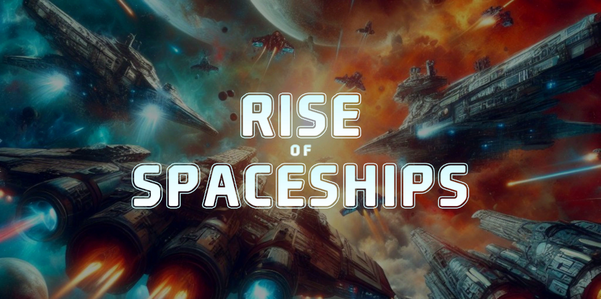
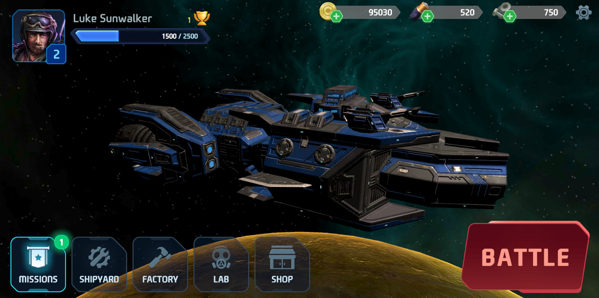
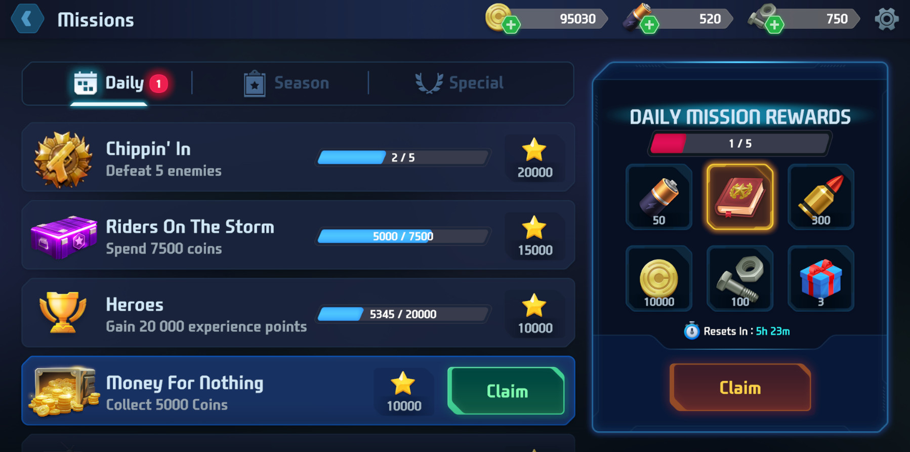
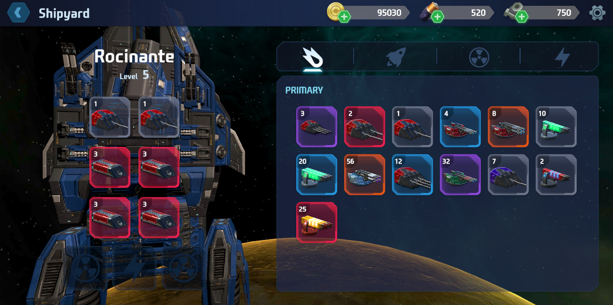
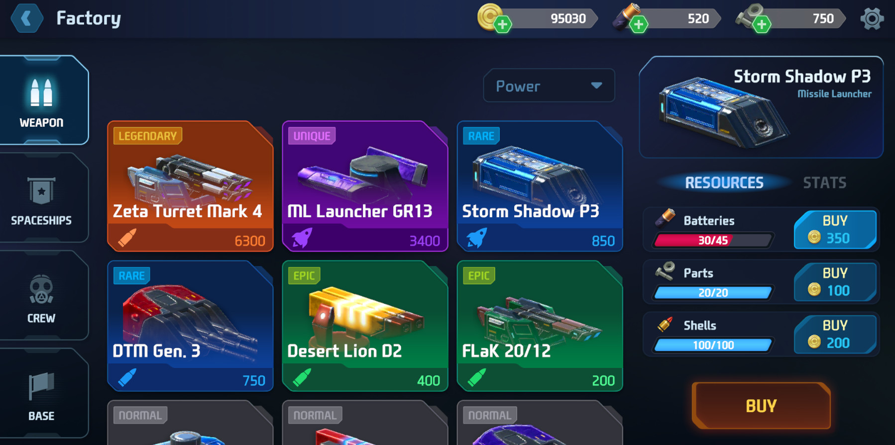
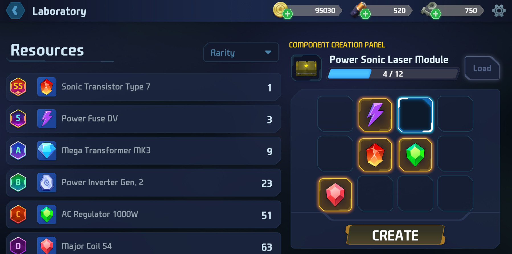
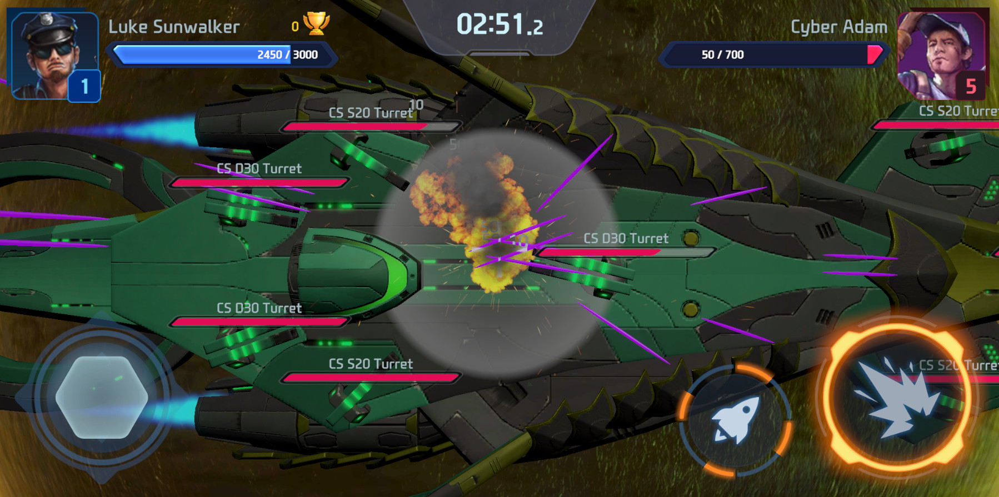
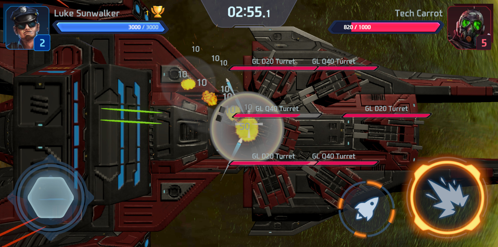
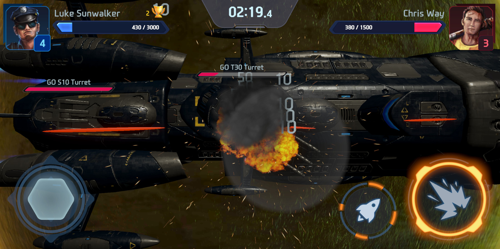

# About this game

### In a galaxy where empires clash and star systems tremble, command your own destiny in the ultimate mobile gaming experience: "Rise of Spaceships". Engage in heart-pounding battles against enemy armadas, expand your base to unlock new technologies, and forge formidable weapons to dominate the cosmos. With thrilling missions that test your strategic prowess, every decision shapes the fate of the galaxy. Will you rise as a legendary commander or fall to the void? The spaceships await your command in "Rise of Spaceships"!

# Supported Systems

:iphone: Mobile (IV 2024)&nbsp;&nbsp;&nbsp;:computer: PC (TBA)

# Technologies 

- Scriptable Objects
- Unity Event System
- Interfaces
- Object Pooling
- New Input System
- Audio System
- User Interfaces
- Addressables

# What's new

Version 0.5.3:
- Loading scene added
- Added a welcome screen with a logo
- Added new weapon items
- Added experience increase after losing a battle

# Screenshots

